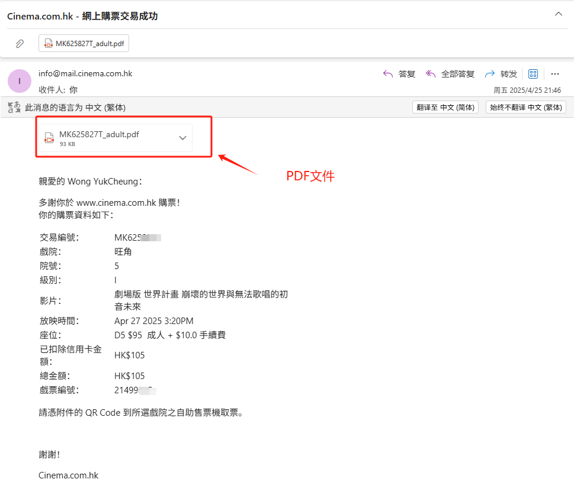
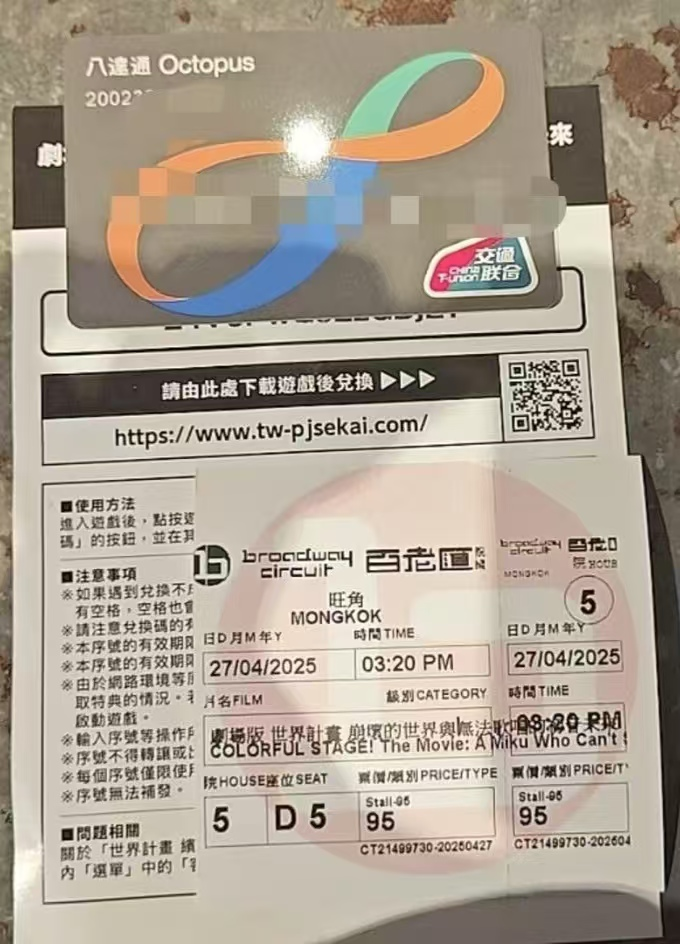

# 前往香港观影

> 本文主要讲解内地观众前往香港观影的步骤。香港观众也可参考

## 一、入境香港准备

> 香港居民无需准备通行证

准备材料:往来港澳通行证/有效的个人旅游/商务签注

深圳居民可办一年多次签注

## 二、购买影票

> 请注意 由于内地与香港的惯用词语不同,所以下文中的“戏院”为影院的意思。

由于影院放映接近尾声,请务必提前在[香港电影 HKMovie](https://hkmovie6.com/movie/016c22be-3bf7-4859-a8b4-65a9539547db/%E5%8A%87%E5%A0%B4%E7%89%88_%E4%B8%96%E7%95%8C%E8%A8%88%E7%95%AB_%E5%B4%A9%E5%A3%9E%E7%9A%84%E4%B8%96%E7%95%8C%E8%88%87%E7%84%A1%E6%B3%95%E6%AD%8C%E5%94%B1%E7%9A%84%E5%88%9D%E9%9F%B3%E6%9C%AA%E4%BE%86) 网站查询剩余影院。

请注意,在香港购票,需要一张Mastercard或Visa外标卡，且以信用卡为佳。慎用中信银行万事达借记卡(中信拒付王),失败概率较大。

点击想要去的影院(以英皇戲院（屯門新都商場）为例):

点击电影排布时间,选择座位。无需登录账户,输入邮箱,付款以锁定座位。

若成功收到购票成功邮件(如下图所示)，证明购票成功

### 三、入境香港、到达影院取票

可以从香港国际机场、香港西九龙站等交通口岸 或通过深圳福田、罗湖、深圳湾等口岸入境香港,使用地图软件导航。搭乘港铁或巴士前往影院。

**建议办理一张八达通** 无论是否是租用版、销售版、全国通。在香港的很多直接、间接消费、公共交通需要用到它。可以使用微信小程序"八达通充值 Octopus Reloading"进行充值。

前往影院后,**一定要前往柜台**取票。一般柜员会使用普通话与你交流。无需使用粤语或英语。

取票成功后,你应该持有下图中(除了八达通)的以下物料。

一张兑换码(这也是为什么要去柜台兑换的原因)，一张电影票

千万注意香港的影院不能自带食品,有也不能明面的带,注意躲避巡检人员

至此,教程结束,你应该能顺利的进入影院观影了

